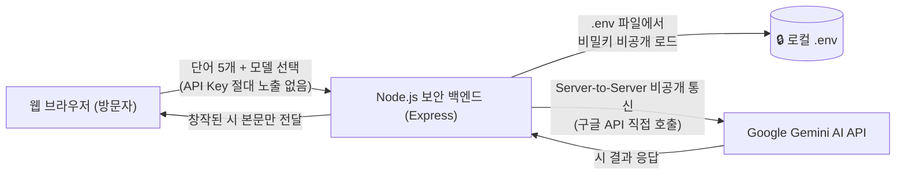

# 시원 (詩苑) - 한국 서정시 창작소 🌸
### Google Gemini 보안 백엔드 · 유튜브 BGM · 다채로운 맞춤 성우 낭송 탑재

마음에 머무는 다섯 개의 단어를 입력받아, 한국 전통의 깊은 여운을 지닌 현대 서정시를 창작해 주는 웹 서비스입니다.  
**정보보안 지침을 철저히 준수**하여 Google Gemini API 키가 웹 클라이언트에 절대 노출되지 않도록 **보안 백엔드(Server-to-Server)** 구조로 설계되었으며, **분위기별 유튜브 배경음악 자동 재생**과 **성우 맞춤형(남/여, 20대/40대/60대) 낭송** 기능이 탑재되어 있습니다.

---

## ✨ 새로운 핵심 기능

### 1. 🎵 구글 유튜브 분위기 BGM (보컬 없는 연주곡) 자동 재생
* **시풍 맞춤형 엄선 연주곡**: 시의 분위기에 따라 보컬이 없는 정갈한 인스트루멘탈 트랙을 자동 매칭합니다:
  * **김소월 풍 (아련한 그리움)**: 한국 전통 가야금 & 대금 서정 연주
  * **윤동주 풍 (순결한 자아 성찰)**: 별빛 밤의 고요한 클래식 피아노
  * **박목월 풍 (담백한 자연과 고향)**: 청산(靑山)의 바람과 자연 힐링 선율
  * **정호승 풍 (따스한 온기와 위로)**: 따뜻한 첼로 & 피아노 멜로디
  * **나태주 풍 (풋풋한 첫사랑의 설렘)**: 봄날의 어쿠스틱 기타 선율
* **스마트 자동 재생**: [서정시 짓기]로 새로운 시가 완성되면 분위기에 맞는 유튜브 배경음악이 자동으로 은은하게 흘러나옵니다.
* **플레이어 제어**: 음악 재생/일시정지, 음량 슬라이더 조절, 유튜브 영상 팝업 열기/접기를 지원합니다.

### 2. 🎙️ 시 낭송 성우 맞춤 설정 (성별 × 연령대 6종 프로필)
* **성별 선택**: `👩 여성 성우` / `👨 남성 성우`
* **연령대 선택**:
  * `🌱 20대 (청년)`: 맑고 청초하며 다정한 목소리
  * `🌿 40대 (중년)`: 차분하고 성숙하며 신뢰감 있는 목소리
  * `🌾 60대 (노년)`: 깊은 연륜과 사유가 깃든 원로 시인의 그윽한 목소리
* **🎧 목소리 미리듣기**: 낭송 전 각 성우의 톤을 미리 청취할 수 있습니다.
* **오디오 더킹 (Audio Ducking)**: 시 낭송이 시작되면 유튜브 배경음악 볼륨이 자동으로 낮아져 성우의 낭독이 또렷하게 들리고, 낭송이 끝나면 BGM 볼륨이 원래대로 복원됩니다.

---

## 🔒 정보보안 준수 아키텍처



* **프론트엔드 비노출 (Zero Key Exposure)**: 소스 코드 및 네트워크 패킷 어디에도 API Key가 노출되지 않습니다.
* **`.gitignore` 보호**: `.env` 파일은 깃허브 원격 저장소에 절대 커밋되지 않습니다.
* **DDoS 방어**: `express-rate-limit`으로 15분당 30회 속도 제한 적용.

---

## 🚀 로컬 실행 방법

```bash
# 1. 의존성 설치 (최초 1회)
npm install

# 2. 서버 실행
npm start
```

서버 구동 후 브라우저 접속:
👉 **`http://localhost:3000`**

---

## 🌐 GitHub Pages (`https://arang5427.github.io/Poetry/`) 업데이트 방법

1. 브라우저에서 **[https://github.com/arang5427/Poetry](https://github.com/arang5427/Poetry)** 접속
2. `Add file` > `Upload files` 클릭
3. 바탕화면 `anti-vibe` 폴더의 아래 4개 파일을 드래그 앤 드롭:
   * `index.html`
   * `style.css`
   * `app.js`
   * `README.md`
   *(⚠️ 주의: 비밀 키가 있는 `.env` 파일은 절대 올리지 마세요)*
4. 하단 `Commit changes` 클릭 후 1분 뒤 [https://arang5427.github.io/Poetry/](https://arang5427.github.io/Poetry/)에서 확인!
