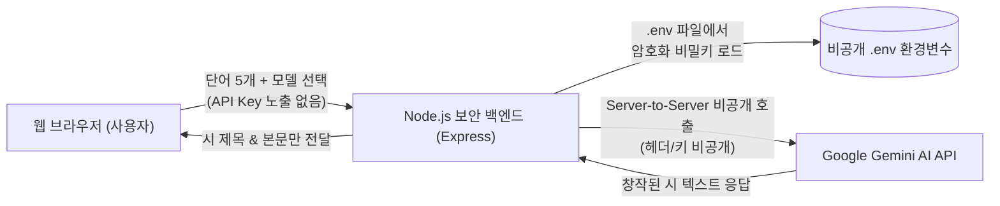

# 시원 (詩苑) - 한국 서정시 창작소 🌸
### Google Gemini 보안 백엔드 아키텍처 탑재

마음에 머무는 다섯 개의 단어를 입력받아, 한국 전통의 깊은 여운을 지닌 현대 서정시를 창작해 주는 웹 서비스입니다.  
**정보보안 지침을 철저히 준수**하여 Google Gemini API 키가 브라우저나 웹 클라이언트에 절대 노출되지 않도록 **보안 백엔드(Server-to-Server)** 구조로 설계되었습니다.

---

## 🔒 정보보안 준수 아키텍처



### 1. 보안 핵심 원칙
* **프론트엔드 비노출 (Zero Key Exposure)**: 웹 브라우저의 소스 코드(HTML/JS) 및 개발자 도구(F12 Network 탭) 어디에도 Google API Key가 일체 전송되거나 노출되지 않습니다.
* **환경변수 파일 분리 (`.env`)**: 실제 비밀 키는 서버 로컬의 `.env` 파일에만 보관됩니다.
* **Git 누출 차단 (`.gitignore`)**: `.gitignore`에 `.env`, `*.env`가 등록되어 있어 GitHub 등 원격 저장소에 절대 업로드되지 않습니다.
* **DDoS 및 비용 폭탄 방지 (`express-rate-limit`)**: 동일 IP당 15분 내 최대 30회로 요청 횟수를 제한하여 무단 호출 및 오남용을 원천 차단합니다.
* **보안 헤더 및 입력값 검증 (`helmet` & Payload Sanitize)**: XSS 방지 보안 헤더 및 단어 길이/배열 크기 검증을 수행합니다.
* **.env 웹 직접 접근 원천 차단**: 브라우저에서 `/.env` 주소로 직접 접근 시 즉시 `403 Forbidden` 차단 처리됩니다.

---

## 🔑 1. 구글 API 키 등록 방법 (`.env`)

1. [Google AI Studio](https://aistudio.google.com/app/apikey)에서 무료 API 키를 발급받습니다.
2. 프로젝트 루트 폴더의 **`.env`** 파일을 메모장이나 에디터로 엽니다.
3. 아래와 같이 등호(`=`) 뒤에 발급받은 키를 붙여넣고 저장합니다:

```ini
# .env 파일 내용
GEMINI_API_KEY=AIzaSy...여기에_발급받은_키_입력
PORT=3000
NODE_ENV=development
```

> **참고**: `.env.example` 파일은 깃허브 공유를 위한 양식 템플릿이며, 실제 키는 반드시 `.env` 파일에만 넣어야 안전합니다.

---

## 🚀 2. 로컬 실행 방법

### 의존성 패키지 설치 (최초 1회)
```bash
npm install
```

### 서버 구동
```bash
npm start
```

서버가 구동되면 웹 브라우저에서 아래 주소로 접속합니다:
👉 **`http://localhost:3000`**

---

## 🌐 3. 다른 사람들에게 웹 서비스로 배포하는 방법

GitHub Pages는 정적 파일(HTML/JS)만 호스팅하므로 백엔드(`.env`)를 실행할 수 없습니다.  
다른 사람들이 접속하여 안전하게 사용할 수 있도록 하려면 **무료 백엔드 클라우드 호스팅(Render, Railway, Glitch 등)**에 배포하는 것을 권장합니다:

### [추천] Render (render.com) 무료 배포 (5분 완성)
1. 코드를 GitHub 저장소에 올립니다 (이때 `.env`는 `.gitignore` 덕분에 자동으로 제외됩니다).
2. [Render.com](https://render.com) 무료 가입 후 **`New +` > `Web Service`** 클릭
3. GitHub의 `Poetry` 저장소를 연결합니다.
4. 설정값:
   * **Build Command**: `npm install`
   * **Start Command**: `node server.js`
5. **Environment Variables (환경 변수)** 탭에서:
   * Key: `GEMINI_API_KEY`
   * Value: 본인의 구글 API 키 값 입력
6. **Deploy Web Service**를 누르면 끝! 전 세계 누구나 접속할 수 있는 보안 웹 링크(`https://서비스이름.onrender.com`)가 생성됩니다.

---

## 📁 프로젝트 파일 구조

```
anti-vibe/
├── .env                # 🔒 구글 Gemini API 비밀 키 (Git 배제)
├── .env.example        # 깃허브 배포용 환경변수 템플릿
├── .gitignore          # .env 및 node_modules 유출 방지
├── server.js           # 보안 백엔드 서버 (Express, Helmet, Rate Limiter)
├── package.json        # 의존성 패키지 설정
├── public/             # 웹 브라우저 클라이언트 서빙 폴더
│   ├── index.html      # 정갈한 고가독성 UI
│   ├── style.css       # 한지 질감 & 고운바탕 서체
│   └── app.js          # 백엔드 API 연동 (API Key 노출 없음)
└── README.md           # 프로젝트 안내 및 보안 가이드
```
