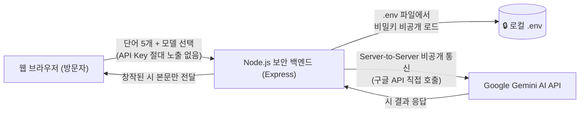

# 시원 (詩苑) - 한국 서정시 창작소 🌸 `Ver-3`
### Google Gemini 보안 백엔드 · 유튜브 BGM · 다채로운 맞춤 성우 낭송 탑재

마음에 머무는 다섯 개의 단어를 입력받아, 한국 전통의 깊은 여운을 지닌 현대 서정시를 창작해 주는 웹 서비스입니다.  
**정보보안 지침을 철저히 준수**하여 Google Gemini API 키가 웹 클라이언트에 절대 노출되지 않도록 **보안 백엔드(Server-to-Server)** 구조로 설계되었으며, **분위기별 유튜브 배경음악 자동 재생**과 **성우 맞춤형(남/여, 20대/40대/60대) 낭송** 기능이 탑재되어 있습니다.

---

## 📋 버전 업데이트 내역 (Version History)

### 🌟 Ver-3 (최신 업데이트)
* **📖 시 낭송 시 문단 내 '행(Line) 단위' 실시간 연한 노랑색 하이라이트 기능 추가**:
  * 시 낭송(TTS) 시 전체 문단이 한꺼번에 묶여 표시되던 방식을 혁신하여, 성우가 지금 읽고 있는 **정확한 한 행(Line, 시구)**마다 **연한 노랑색(`Soft Pastel Yellow`, `#fef9c3`) 배경**, **황금빛 호박색 포인트 바 (`#f59e0b`)**, **은은한 그림자(Glow)**로 실시간 강조 표시합니다.
  * **행간 호흡(Line Pause) & 연간 여운(Stanza Pause) 지연 엔진**과 1:1 정밀 연동되어 실제 시인이 행을 낭독하고 숨을 고르는 듯한 깊은 운율감을 선사합니다.
  * 낭독 진행 행에 맞추어 시선이 자연스럽게 따라갈 수 있도록 **부드러운 행 단위 자동 스크롤(Auto Smooth Scrolling)**이 연동됩니다.
* **🏷️ 전역 버전 표기 체계 `Ver-3` 갱신**: 웹 UI 뱃지, 백엔드 API, 콘솔 및 문서화 일괄 반영.

### 🌟 Ver-2
* **📖 시 낭송 시 문단(연) 실시간 연한 노랑색 하이라이트 기능 추가**:
  * 시 낭송(TTS) 재생 시 현재 낭독 중인 시 제목, 각 문단(연, Stanza), 시작노트를 연한 노랑색 배경으로 실시간 강조 표시.
* **🏷️ 전역 버전 표기 체계 `Ver-2` 도입**: 웹 UI 뱃지, 백엔드 API, 콘솔 및 문서화 일괄 반영.

### 🌟 Ver-1
* **🎙️ TTS 별표(`*`) 발화 스킵 개선**: 시 본문 및 시작노트에 포함된 `*` (별표/애스터리스크), 전각 별표(`＊`), 마크다운 강조 기호(`**` 볼드 등)를 TTS 음성 합성 시 "별표"나 기호명으로 소리 내어 읽지 않고 **자연스럽게 스킵/제거**하여 서정시 낭송의 몰입도를 극대화했습니다.
* **🛡️ Google Gemini 트래픽 과부하(503 / High Traffic) 방어 & 스마트 폴백**: 
  * Google API 서버의 일시적 트래픽 폭주(`503: Our servers are experiencing high traffic right now...`, `429 Rate Limit`) 발생 시 자동으로 **1.2초 지연 후 재시도(Retry)**를 수행합니다.
  * 재시도 후에도 과부하가 지속되거나 특정 모델이 지연될 경우, 상위 안정 모델 체인(`gemini-3.8-flash` ➡️ `gemini-3.7-flash` ➡️ `gemini-3.6-flash` ➡️ `gemini-3.5-flash` ➡️ `gemini-flash-latest`)으로 **즉각 스마트 폴백(Smart Fallback)**하여 오류 없이 시 창작을 성공적으로 완료합니다.
* **🏷️ 전역 버전 표기 시스템 도입 (`Ver-N`)**: UI 상단 브랜드 타이틀, 보안 모달, 백엔드 API 상태 및 콘솔에 현재 서비스 버전(`Ver-1`)을 상시 표기하도록 개편하였습니다.

### 🌱 Ver-0 (초기 릴리즈)
* Google Gemini 기반 5개 단어 한국 서정시 창작 백엔드 구축
* 33인의 한국 대표 거장 & 동시대 청년 시인 시풍 엔진 탑재
* 시풍별 무보컬 연주곡 유튜브 BGM 자동 재생 & 스마트 복구
* Google TTS 30가지 음성 매칭 및 성별·연령대 감성 파라미터 조절

---

## ✨ 새로운 핵심 기능

### 1. 🌐 Google TTS 30가지 음성 (voice_name) 지원 & 감성 자동 튜닝
* **Google 30가지 음성 옵션 탑재**: 구글 TTS 모델의 공식 `voice_name` 30종을 완벽 지원하며, 각 보이스의 음색 특성에 맞추어 피치(Pitch), 발화 속도(Rate), 행간/연간 호흡(Pause)을 정밀 튜닝합니다:
  * `Zephyr` (Bright - 화사하고 밝음), `Puck` (경쾌함 - 재치 있는 리듬), `Charon` (유용한 정보 전달 - 차분함), `Kore` (Firm - 단호함/절제), `Fenrir` (Excitable - 격정/열정)
  * `Leda` (Youthful - 풋풋한 젊음), `Orus` (Firm - 묵직한 단호함), `Aoede` (Breezy - 산들바람 서정), `Callirrhoe` (느긋함 - 편안한 긴 호흡), `Autonoe` (밝음 - 환하고 따스함)
  * `엔셀라두스` (Enceladus - 숨소리/밀어), `Iapetus` (Clear - 청명하고 선명함), `Umbriel` (느긋함 - 고요한 밤의 그윽함), `Algieba` (Smooth - 부드러움), `Despina` (Smooth - 감미로움)
  * `Erinome` (맑음 - 청아한 이슬), `Algenib` (자갈 - 거친 민초의 질감), `Rasalgethi` (유용한 정보 전달 - 명료한 사유), `Laomedeia` (경쾌함 - 청량한 리듬), `Achernar` (Soft - 포근함)
  * `Alnilam` (Firm - 강인한 기백), `Schedar` (Even - 평온함), `Gacrux` (성인용 - 연륜의 중후함), `Pulcherrima` (앞으로 - 진취성), `Achird` (친근함 - 다정한 말투)
  * `Zubenelgenubi` (캐주얼 - 자연스러움), `Vindemiatrix` (온화함 - 자애로움), `Sadachbia` (활기참 - 생동감), `Sadaltager` (지식이 풍부함 - 깊은 지성), `Sulafat` (따뜻함 - 포근한 온기)
* **시풍 자동 매칭**: 시인을 선택하면 해당 시인의 문학적 정서에 가장 어울리는 Google TTS 보이스가 실시간으로 자동 연동됩니다. (수동 선택 전환 가능)
* **🎧 음성 미리듣기**: 낭송 전 선택한 음성의 톤과 낭독 질감을 바로 청취할 수 있습니다.
* **오디오 더킹 (Audio Ducking)**: 낭송 시작 시 배경음악 음량이 자동으로 부드럽게 감소하고 낭송이 끝나면 원래 음량으로 복원됩니다.

### 2. 📜 한국 서정 거장 & 동시대 청년 시인 33인 시풍 엔진
* **📜 고전 서정의 명시인 (10인)**: 윤동주 ('하늘과 바람과 별과 시'), 김소월 ('진달래꽃'), 나태주 ('풀꽃'), 박목월 ('나그네'), 정호승 ('사랑하다가 죽어버려라'), 김춘수 ('꽃'), 서정주 ('무서운 시간'), 신경림 ('갈대'), 황동규 ('사랑의 전당' / '즐거운 편지'), 안도현 ('연탄 한 장')
* **🌌 사유와 시대의 깊은 울림 (12인)**: 고은 ('만인보'), 이상 ('오감도'), 한강 ('서랍에 저녁을 넣어 두었다'), 황지우 ('새들도 세상을 뜨는구나'), 김훈 ('칼의 노래'), 이문재 ('지금 여기가 맨 앞'), 유안진 ('지란지교를 꿈꾸며'), 최승호 ('대설주의보'), 신달자 ('열애'), 김경주 ('나는 이 세상에 없는 계절이다'), 김해자 ('무기여 잘 있거라'), 조정환 (사유와 실존의 시학)
* **🌿 현대 문학과 독창적 일상 감성 (6인)**: 박준 ('당신의 이름을 지어다가 며칠은 먹었다'), 강화길 (심리 서정), 문보영 ('책기둥'), 최정화 (모던 감각), 김민정 ('날씨와 생활'), 김이듬 ('히스테리아')
* **🌱 동시대 청년 신진 시인 (5인)**: 황인찬 ('기쁜 이와 함께 나를 나눌 것'), 양안다 ('빛과 매듭'), 육호수 ('나는 나비와 날고'), 김보나 ('김근종'), 강우근 ('개미 한마리를 실수로 밟을 뻔한 날')

### 3. 🎵 구글 유튜브 분위기 BGM (보컬 없는 연주곡) 자동 재생 & 스마트 복구 엔진
* **시풍 맞춤형 다중 연주곡 플레이리스트**: 사색, 전통, 자연, 위로, 설렘, 모던 앰비언트 등 시인의 정서에 어울리는 보컬 없는 연주곡 다중 후보군을 탑재했습니다.
* **🛡️ BGM 재생 실패 시 자동 복구 (Auto-Recovery)**: 유튜브 영상 삭제, 외부 임베드 제한(Error 101/150 등)으로 재생이 차단될 경우, 플레이어가 이를 즉각 감지하여 시풍에 맞는 다른 고품질 연주곡을 자동으로 탐색하여 끊김 없이 전환 재생합니다.
* **🔀 다른 BGM 추천 / 새로고침**: 시풍에 맞는 다음 후보곡으로 언제든지 즉시 교체하여 청취할 수 있습니다.
* **🔍 유튜브 맞춤 검색**: 현재 선택된 시인과 시풍 키워드가 자동으로 조합된 유튜브 검색창(`[시인] 분위기 잔잔한 서정 연주곡 BGM`)을 원클릭으로 열어 원하는 음악을 찾을 수 있습니다.
* **🔗 사용자 맞춤 유튜브 링크 직접 지정**: 영상 팝업 내에서 사용자가 원하는 유튜브 영상 주소(URL)나 ID를 입력하여 나만의 배경음악으로 감상할 수 있습니다.
* **플레이어 제어**: 음악 재생/일시정지, 음량 슬라이더 조절, 유튜브 영상 팝업 열기/접기를 지원합니다.

---

## 🔒 정보보안 준수 아키텍처



* **프론트엔드 비노출 (Zero Key Exposure)**: 소스 코드 및 네트워크 패킷 어디에도 API Key가 노출되지 않습니다.
* **`.gitignore` 보호**: `.env` 파일은 깃허브 원격 저장소에 절대 커밋되지 않습니다.
* **DDoS 방어**: `express-rate-limit`으로 15분당 30회 속도 제한 적용.

---

## 🚀 로컬 실행 방법

```bash
# 1. 의존성 설치 (최초 1회)
npm install

# 2. 서버 실행
npm start
```

서버 구동 후 브라우저 접속:
👉 **`http://localhost:3000`**

---

## 🌐 GitHub Pages (`https://arang5427.github.io/Poetry/`) 업데이트 방법

1. 브라우저에서 **[https://github.com/arang5427/Poetry](https://github.com/arang5427/Poetry)** 접속
2. `Add file` > `Upload files` 클릭
3. 바탕화면 `anti-vibe` 폴더의 아래 4개 파일을 드래그 앤 드롭:
   * `index.html`
   * `style.css`
   * `app.js`
   * `README.md`
   *(⚠️ 주의: 비밀 키가 있는 `.env` 파일은 절대 올리지 마세요)*
4. 하단 `Commit changes` 클릭 후 1분 뒤 [https://arang5427.github.io/Poetry/](https://arang5427.github.io/Poetry/)에서 확인!
