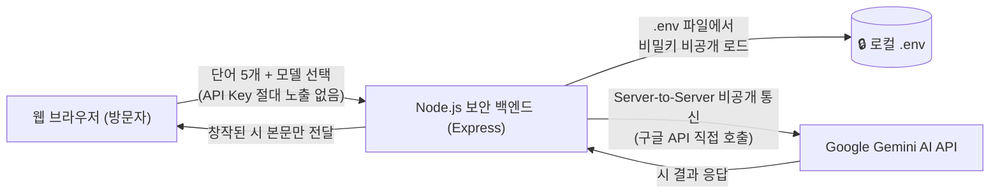

# 시원 (詩苑) - 한국 서정시 창작소 🌸 `Ver-10`
### AI 사진 심층 분석(구도·분위기·맥락·감성·행동) · 추천 시어 단어별 인라인 수정 · 한국 시문학 심사평가위원 3인 평가 & 글다듬기 · TTS 슬래시 스킵 탑재

마음에 머무는 다섯 개의 단어를 직접 입력하거나 **업로드한 사진을 AI 멀티모달로 정밀 분석**하여, 한국 전통의 깊은 여운을 지닌 현대 서정시를 창작해 주는 웹 서비스입니다.  
**정보보안 지침을 철저히 준수**하여 Google Gemini API 키가 웹 클라이언트에 절대 노출되지 않도록 **보안 백엔드(Server-to-Server)** 구조로 설계되었으며, **사진의 구도·분위기·맥락·감성·피사체 행동을 아우르는 5대 심층 분석 및 50자 감성 해설**, **추천 시어 단어별 인라인 수정(Editable Chips)**, **한국 시문학 심사평가위원 3인의 심사평 및 글다듬기(재구성) 엔진**, **TTS 슬래시 발화 스킵**, **사진 표시창(Display Window)**, **분위기별 유튜브 배경음악 자동 재생**, **성우 맞춤형 낭송**, 그리고 **PDF 문헌 기반 시적 운율과 감정 융합 엔진**이 탑재되어 있습니다.

---

## 📋 버전 업데이트 내역 (Version History)

### 🌟 Ver-10 (최신 업데이트)
* **📸 AI 사진 멀티모달 5대 심층 분석 엔진 고도화**:
  * 사진 업로드 시 단순 색채 분석을 넘어 **[1. 사진적 구도(앵글/원근/삼분할/여백/시선흐름) · 2. 분위기(명암/조명/색온도/공기감) · 3. 전체적 맥락(계절/시간대/공간서사) · 4. 시적 감성(내밀한 정서적 울림) · 5. 피사체의 행동 분석(인물/동물/자연물의 움직임/머무름/시선)]**의 5대 핵심 미학 요소를 입체적으로 종합 분석합니다.
  * 위 5대 요소를 정밀 응축하여 **한국어 공백 포함 정확히 50자 이내**의 시적 감성 해설문으로 도출합니다.
  * 작성된 사진 감성 해설과 심층 분석 맥락을 바탕으로, 피사체의 행동 및 구도와 가장 긴밀하게 연계된 **한국어 서정 시어 5개**를 정밀 추출하여 5개 입력창에 자동 입력합니다. (17대 클리셰 금지어 차단 유지)
* **✏️ 자동 추출된 추천 시어 '단어별 인라인 직접 수정' UI/UX 추가**:
  * 사진 표시창(Photo Display Window) 내 추천 시어 칩을 사용자가 **단어별로 즉시 수정**할 수 있는 대화형 인터페이스(`Editable Word Chips`)를 구축했습니다.
  * 각 단어 칩을 클릭하거나 연필 아이콘(`✏️`)을 클릭하면 즉각 인라인 입력 모드로 전환되며, 수정 후 엔터(`Enter`) 또는 확인(`✓`) 클릭 시 해당 단어가 즉시 저장 및 갱신됩니다.
  * **실시간 양방향 동기화**: 사진 표시창에서 단어를 수정하면 1단계 5개 단어 입력창(`word1` ~ `word5`)에 실시간 자동 반영되며, 반대로 1단계 '직접 시어 입력' 패널에서 단어를 수정해도 사진 표시창의 칩 텍스트가 즉각 동기화됩니다.
* **🏷️ 전역 버전 표기 체계 `Ver-10` 갱신**: 웹 헤더 뱃지, 보안 모달 체크리스트, 관리자 페이지, 백엔드 API 상태, 콘솔 로그, README, package.json(`1.10.0`) 일괄 반영.

### 🌟 Ver-9
* **🎙️ TTS 슬래시(`/`, `／`) 발화 스킵 개선**:
  * 시 낭송(TTS) 시 본문이나 제목, 노트에 포함된 반각 슬래시(`/`), 전각 슬래시(`／`), 특수 슬래시 기호(`⁄`, `⧸`)가 "슬래시", "빗금", "나누기" 등의 기계적 기호명으로 소리 내어 읽히지 않고 **자연스러운 행간 호흡(공백)**으로 스킵되도록 음성 정제 엔진을 전면 강화했습니다.
* **🏆 한국 시문학 심사평가위원 3인 평가 & 글다듬기(재구성) 엔진 탑재**:
  * **3단계 문학 파이프라인**: '서정시 짓기' 실행 시 **[1단계 초고 창작 ➡️ 2단계 3인 심사위원 정밀 합평 및 채점 ➡️ 3단계 심사평을 바탕으로 한 최종 시 재구성(글다듬기)]**의 유기적 창작 프로세스를 수행합니다.
  * **3대 전문 심사평가위원단**:
    1. **김형상 심사위원 (시적 이미지 & 감각적 은유)**: 감각적 심상(시각·청각·촉각)의 선명성, 상투적 클리셰 척결, 독창적인 비유와 형상화 심사.
    2. **박가락 심사위원 (운율학 & 한국어 음악성)**: 7·5조/3·4조 음수율, 3·4음보, 어미 각운 및 울림소리(ㄴ, ㄹ, ㅁ, ㅇ) 내운의 음악적 조화 심사.
    3. **이여백 심사위원 (서정성 & 시상 전개)**: 기승전결의 긴장과 이완, 사유의 깊이, 결구의 여운과 아포리즘적 종결성 심사.
  * **초고 vs 글다듬기 완성작 실시간 비교 토글**: 사용자가 `[✨ 최종 글다듬기 완성작]`과 `[📜 초고(初稿) 보기]` 탭 버튼을 클릭하여 퇴고 전후의 문학적 변화를 한눈에 비교할 수 있습니다. 낭송 시에도 현재 보고 있는 버전을 기준으로 정확히 낭독합니다.
  * **💎 글다듬기(퇴고) 개선 포인트 & 종합 평점 리포트**: 종합 평점 뱃지(예: `93.0점`), 위원별 심사평 및 퇴고 조언 카드, 3대 퇴고 성과 체크리스트를 투명하게 제공합니다.
  * **✨ 3인 심사위원 글다듬기 (재퇴고) 원클릭 버튼**: 현재 완성된 시를 바탕으로 심사위원단에 다시 한번 추가 퇴고를 요청할 수 있는 전용 액션 버튼을 탑재했습니다.
* **🏷️ 전역 버전 표기 체계 `Ver-9` 갱신**: 웹 헤더 뱃지, 보안 모달 체크리스트, 백엔드 API 상태, 콘솔 로그, README, package.json(`1.9.0`) 일괄 반영.

### 🌟 Ver-8
* **📷 "사진업로드및분석" 메뉴탭 & 사진업로드 박스 & 사진 표시창 시스템 추가**:
  * **2단 메뉴탭(Tab Navigation) 인터페이스**: 1단계 '다섯 가지 시어 입력' 상단에 `✍️ 직접 시어 입력` 탭과 `📷 사진업로드 및 분석` 탭을 배치하여 사용자가 직관적으로 원하는 모드를 선택할 수 있도록 개편했습니다.
  * **사진업로드 박스(Drop Zone)**: 드래그 앤 드롭 및 원클릭 파일 탐색기를 지원하는 우아한 점선 박스와 사진 감상 중 실시간 애니메이션 스피너를 제공합니다.
  * **사진 표시창(Photo Display Window)**: 사진 업로드 및 분석 완료 시 나타나는 전용 디스플레이 윈도우로, 액자 프레임 형태의 고화질 프리뷰, 원클릭 삭제(`✕`) 버튼, 50자 이내 시적 감성 해설 카드, 실시간 글자수 배지(`0/50자`), 자동 추출된 추천 시어 5개 칩 태그, 그리고 `💭 시 감정에 반영하기`, `✍️ 입력된 시어 확인하기` 전환 버튼을 통합 제공합니다.
  * **자동 분석 및 추천 시어 5개 자동 입력**: 사진 업로드 즉시 AI가 사진의 색채와 정서를 분석하여 17대 클리셰 금지어가 배제된 5개의 추천 시어를 자동 추출하고, 단어 입력창 5곳에 즉시 순차 입력하며 펄스 애니메이션으로 시각적 피드백을 제공합니다.
* **🏷️ 전역 버전 표기 체계 `Ver-8` 갱신**: 웹 헤더 뱃지, 보안 모달 체크리스트, 백엔드 API 상태, 콘솔 로그, README 일괄 반영.

### 🌟 Ver-7
* **📷 사진 분석(Vision) 기반 시어 5개 자동 추출 & 사진 설명란(50자 이내) 탑재**:
  * **사진 업로드 & AI Vision 분석**: 사용자가 사진을 드래그 앤 드롭하거나 클릭하여 업로드하면, Google Gemini 멀티모달 AI가 사진의 색채, 빛과 어둠, 자연물, 서정적 분위기를 정밀 분석합니다.
  * **시어 5개 자동 추출 & 입력**: 사진의 정서를 대표하는 아름다운 한국어 서정 시어 5개를 자동 추출하여 1단계 단어 입력창 5곳에 즉각 채워 넣고 펄스 애니메이션으로 강조합니다. (17대 클리셰 금지어 원천 배제)
  * **사진 감성 분석 설명란 (50자 이내)**: 사진 속 풍경과 서정적 감성을 공백 포함 **정확히 50자 이내**로 함축 요약한 설명 카드와 실시간 글자수 카운터 뱃지를 제공합니다.
  * **💭 시 감정(느낌)에 반영하기**: 사진 설명란 우측 버튼을 누르면 해당 분석 설명문이 2단계 '시 감정 입력창'에 즉시 복사되어 시인풍 및 운율과 융합됩니다.
  * **브라우저 캔버스 고속 압축**: 스마트폰 고용량 사진(10~20MB)도 브라우저 Canvas에서 1280px 해상도로 자동 리사이징/압축하여 1~2초 내에 쾌속 처리됩니다.
  * **하이브리드 지원**: 보안 백엔드(`/api/analyze-image`) 및 GitHub Pages 정적 배포(클라이언트 Gemini Vision 호출), 데모 모드를 완벽 지원합니다.
* **🏷️ 전역 버전 표기 체계 `Ver-7` 갱신**: 웹 UI 뱃지, 모달 체크리스트, 백엔드 API, 콘솔 로그, README 일괄 반영.

### 🌟 Ver-6
* **📚 PDF 4대 한국 문학·작법 문헌 심층 학습 및 운율·율격 엔진 탑재**:
  * 워크스페이스 내 핵심 문헌 4종(`장르별 한글(한국어) 노래가사 리듬과 운윤분석_2025.pdf`, `한국의 서정적 시 단어분석.pdf`, `한국의 한국어 아름다운 문장 순위 1위_1000위_2025.pdf`, `인공지능_글쓰기 전략.pdf`)을 정밀 추출·분석하여 체계적인 한국어 시적 리듬 가이드를 구축했습니다.
  * **5대 시적 운율 스타일 옵션 제공**:
    1. `auto`: 자동 최적화 (시인의 문학적 정체성과 사용자 감정에 맞춰 최적 율격 자동 조율)
    2. `folk_rhythm`: 애틋한 7·5조 민요풍 (3음보 서정, 김소월 진달래꽃 계통의 민요조 가락과 유음/비음 각운)
    3. `classical_meter`: 단정한 3·4 / 4·4조 가사풍 (4음보 정통 기품, 시조와 가사의 단아한 균형미와 철학적 경구)
    4. `modern_free`: 감각적 현대 자유율 (단음절·짧은 행과 긴 호흡의 파도식 교차, 시각적·심리적 여백)
    5. `meditative_prose`: 깊은 사유의 명상적 율격 (강물처럼 유장한 산문적 내재율과 침묵의 호흡)
* **🎭 삼원 융합(Tri-Harmonic Fusion) 시 창작 엔진**:
  * **[1. 시인풍 33인]** (대표 모티프, 사유의 깊이, 시적 어조)
  * **[2. 사용자 감정표현(느낌)]** (비 내리는 밤의 쓸쓸함, 따뜻한 위로 등 사용자의 솔직한 심상)
  * **[3. 학습된 시적 운율]** (음수율, 음보율, 울림소리 음운 조화, 종결구의 아포리즘)
  * 세 요소를 AI 백엔드 및 클라이언트 프롬프트에서 유기적으로 결합하여 읽었을 때 운율이 살아 숨 쉬는 최고의 한국 서정시를 완성합니다.
* **🎵 UI & 백엔드 실시간 연동**:
  * Step 2 옵션창에 `🎵 시적 운율 & 리듬 튜닝 (PDF 4대 문헌 학습)` 드롭다운 추가.
  * 백엔드(`/api/generate-poem`) 및 클라이언트 Gemini 호출 시 `prosody_style` 파라미터를 양방향 전송하고, 생성된 시 카드 상단에 적용된 운율을 명시(`시인 시풍 · 모델 · 낭송 · 운율`).
* **🛡️ 17대 금지단어 필터 및 4096 토큰 완결성 보장 유지**:
  * Ver-5의 상투적 클리셰 17종 차단 및 4096 토큰 완결성 보장 지침을 운율 엔진과 빈틈없이 결합.
* **🏷️ 전역 버전 표기 체계 `Ver-6` 갱신**: 웹 UI 뱃지, 모달 체크리스트, 백엔드 API, 콘솔 로그, README 일괄 반영.

### 🌟 Ver-5
* **🚫 17대 상투적 클리셰 시어 금지 단어(Negative Constraints) 엔진 탑재**:
  * 지나치게 상투적이고 남발되는 한국 시어 17종(`공기, 온기, 발자국, 숨, 네온, 심장, 온도, 계절, 손끝, 가로등, 박자, 쪽으로, 번져, 골목, 발끝, 볕살이, 괜히`)을 AI 프롬프트 네거티브 제약으로 차단하여 신선하고 독창적인 시적 은유를 유도합니다.
  * **조건부 허용**: 사용자가 5개 단어나 감정 입력창에 직접 해당 단어를 명시적으로 요청한 경우에 한해 자연스럽게 창작에 반영됩니다.
* **🎲 한국 대표 서정 시어 159선(`한국_시어_159개.MD`) 무작위 추천 채우기**:
  * 한국 대표 시어 150개 + 한국 고유의 서정 시어 9개(`윤슬, 시나브로, 서리꽃, 산그늘, 물비늘, 풋사랑, 꽃샘추위, 해사하다, 여백`)로 구성된 159개 시어 풀에서 '추천 단어 채우기' 클릭 시 중복 없이 5개 단어를 즉각 추천합니다. (17대 클리셰 금지어는 추천 풀에서 원천 배제)
* **💭 사용자 감정 직접 입력 & 시인풍 예술적 융합(Fusion) 기능**:
  * 사용자가 작성하고자 하는 시의 구체적 감정(예: *비 내리는 늦은 밤의 쓸쓸함, 따뜻한 위로, 아련한 그리움, 첫사랑의 설렘 등*)을 자유롭게 입력할 수 있는 필드 및 감성 태그 칩을 추가했습니다.
  * 선택한 33인의 시인 고유의 시풍과 사용자가 지정한 감정을 유기적으로 융합하여 시를 창작합니다.
* **✨ 시 완결성 보장 및 중간 끊김 현상 개선**:
  * 최대 출력 토큰(`maxOutputTokens`)을 2048에서 **4096 토큰**으로 대폭 상향하여 긴 호흡의 사유나 사고(Thinking) 모델에서도 토큰 부족으로 인한 잘림을 원천 방지했습니다.
  * 프롬프트에 마지막 연과 종결 행, 시작노트까지 완전하게 종결하도록 엄격한 완결성 지침을 추가하고, 유연하고 견고한 마크다운 파서로 개선했습니다.
* **🏷️ 전역 버전 표기 체계 `Ver-5` 갱신**: 웹 헤더 뱃지, 보안 모달, 백엔드 API, 콘솔 및 문서화 일괄 반영.

### 🌟 Ver-4
* **⏹️ 배경음악(BGM) 정지(Stop) 기능 추가**:
  * 기존의 재생/일시정지(`▶️/⏸️`) 토글 외에 음악을 완전히 멈추고 초기화할 수 있는 **`⏹️ BGM 정지` 전용 버튼**을 추가 탑재했습니다.
  * 정지 시 유튜브 Iframe 플레이어의 오디오 스트림 및 버퍼를 완전히 멈추고 큐(Cue) 상태로 리셋하여 정숙한 독서 및 감상 환경을 즉각 조성할 수 있습니다.
* **🏷️ 전역 버전 표기 체계 `Ver-4` 갱신**: 웹 UI 뱃지, 백엔드 API, 콘솔 및 문서화 일괄 반영.

### 🌟 Ver-3
* **📖 시 낭송 시 문단 내 '행(Line) 단위' 실시간 연한 노랑색 하이라이트 기능 추가**:
  * 시 낭송(TTS) 시 성우가 지금 읽고 있는 정확한 한 행(Line, 시구)마다 연한 노랑색(`Soft Pastel Yellow`, `#fef9c3`) 배경과 황금빛 호박색 포인트 바로 실시간 강조 표시.
  * 행간 호흡(Line Pause) & 연간 여운(Stanza Pause) 지연 엔진 및 부드러운 자동 스크롤 연동.
* **🏷️ 전역 버전 표기 체계 `Ver-3` 도입**: 웹 UI 뱃지, 백엔드 API, 콘솔 및 문서화 일괄 반영.

### 🌟 Ver-2
* **📖 시 낭송 시 문단(연) 실시간 연한 노랑색 하이라이트 기능 추가**:
  * 시 낭송(TTS) 재생 시 현재 낭독 중인 시 제목, 각 문단(연, Stanza), 시작노트를 연한 노랑색 배경으로 실시간 강조 표시.
* **🏷️ 전역 버전 표기 체계 `Ver-2` 도입**: 웹 UI 뱃지, 백엔드 API, 콘솔 및 문서화 일괄 반영.

### 🌟 Ver-1
* **🎙️ TTS 별표(`*`) 발화 스킵 개선**: 시 본문 및 시작노트에 포함된 `*` (별표/애스터리스크), 전각 별표(`＊`), 마크다운 강조 기호(`**` 볼드 등)를 TTS 음성 합성 시 "별표"나 기호명으로 소리 내어 읽지 않고 **자연스럽게 스킵/제거**하여 서정시 낭송의 몰입도를 극대화했습니다.
* **🛡️ Google Gemini 트래픽 과부하(503 / High Traffic) 방어 & 스마트 폴백**: 
  * Google API 서버의 일시적 트래픽 폭주(`503: Our servers are experiencing high traffic right now...`, `429 Rate Limit`) 발생 시 자동으로 **1.2초 지연 후 재시도(Retry)**를 수행합니다.
  * 재시도 후에도 과부하가 지속되거나 특정 모델이 지연될 경우, 상위 안정 모델 체인(`gemini-3.8-flash` ➡️ `gemini-3.7-flash` ➡️ `gemini-3.6-flash` ➡️ `gemini-3.5-flash` ➡️ `gemini-flash-latest`)으로 **즉각 스마트 폴백(Smart Fallback)**하여 오류 없이 시 창작을 성공적으로 완료합니다.
* **🏷️ 전역 버전 표기 시스템 도입 (`Ver-N`)**: UI 상단 브랜드 타이틀, 보안 모달, 백엔드 API 상태 및 콘솔에 현재 서비스 버전(`Ver-1`)을 상시 표기하도록 개편하였습니다.

### 🌱 Ver-0 (초기 릴리즈)
* Google Gemini 기반 5개 단어 한국 서정시 창작 백엔드 구축
* 33인의 한국 대표 거장 & 동시대 청년 시인 시풍 엔진 탑재
* 시풍별 무보컬 연주곡 유튜브 BGM 자동 재생 & 스마트 복구
* Google TTS 30가지 음성 매칭 및 성별·연령대 감성 파라미터 조절

---

## ✨ 새로운 핵심 기능

### 1. 🌐 Google TTS 30가지 음성 (voice_name) 지원 & 감성 자동 튜닝
* **Google 30가지 음성 옵션 탑재**: 구글 TTS 모델의 공식 `voice_name` 30종을 완벽 지원하며, 각 보이스의 음색 특성에 맞추어 피치(Pitch), 발화 속도(Rate), 행간/연간 호흡(Pause)을 정밀 튜닝합니다:
  * `Zephyr` (Bright - 화사하고 밝음), `Puck` (경쾌함 - 재치 있는 리듬), `Charon` (유용한 정보 전달 - 차분함), `Kore` (Firm - 단호함/절제), `Fenrir` (Excitable - 격정/열정)
  * `Leda` (Youthful - 풋풋한 젊음), `Orus` (Firm - 묵직한 단호함), `Aoede` (Breezy - 산들바람 서정), `Callirrhoe` (느긋함 - 편안한 긴 호흡), `Autonoe` (밝음 - 환하고 따스함)
  * `엔셀라두스` (Enceladus - 숨소리/밀어), `Iapetus` (Clear - 청명하고 선명함), `Umbriel` (느긋함 - 고요한 밤의 그윽함), `Algieba` (Smooth - 부드러움), `Despina` (Smooth - 감미로움)
  * `Erinome` (맑음 - 청아한 이슬), `Algenib` (자갈 - 거친 민초의 질감), `Rasalgethi` (유용한 정보 전달 - 명료한 사유), `Laomedeia` (경쾌함 - 청량한 리듬), `Achernar` (Soft - 포근함)
  * `Alnilam` (Firm - 강인한 기백), `Schedar` (Even - 평온함), `Gacrux` (성인용 - 연륜의 중후함), `Pulcherrima` (앞으로 - 진취성), `Achird` (친근함 - 다정한 말투)
  * `Zubenelgenubi` (캐주얼 - 자연스러움), `Vindemiatrix` (온화함 - 자애로움), `Sadachbia` (활기참 - 생동감), `Sadaltager` (지식이 풍부함 - 깊은 지성), `Sulafat` (따뜻함 - 포근한 온기)
* **시풍 자동 매칭**: 시인을 선택하면 해당 시인의 문학적 정서에 가장 어울리는 Google TTS 보이스가 실시간으로 자동 연동됩니다. (수동 선택 전환 가능)
* **🎧 음성 미리듣기**: 낭송 전 선택한 음성의 톤과 낭독 질감을 바로 청취할 수 있습니다.
* **오디오 더킹 (Audio Ducking)**: 낭송 시작 시 배경음악 음량이 자동으로 부드럽게 감소하고 낭송이 끝나면 원래 음량으로 복원됩니다.

### 2. 📜 한국 서정 거장 & 동시대 청년 시인 33인 시풍 엔진
* **📜 고전 서정의 명시인 (10인)**: 윤동주 ('하늘과 바람과 별과 시'), 김소월 ('진달래꽃'), 나태주 ('풀꽃'), 박목월 ('나그네'), 정호승 ('사랑하다가 죽어버려라'), 김춘수 ('꽃'), 서정주 ('무서운 시간'), 신경림 ('갈대'), 황동규 ('사랑의 전당' / '즐거운 편지'), 안도현 ('연탄 한 장')
* **🌌 사유와 시대의 깊은 울림 (12인)**: 고은 ('만인보'), 이상 ('오감도'), 한강 ('서랍에 저녁을 넣어 두었다'), 황지우 ('새들도 세상을 뜨는구나'), 김훈 ('칼의 노래'), 이문재 ('지금 여기가 맨 앞'), 유안진 ('지란지교를 꿈꾸며'), 최승호 ('대설주의보'), 신달자 ('열애'), 김경주 ('나는 이 세상에 없는 계절이다'), 김해자 ('무기여 잘 있거라'), 조정환 (사유와 실존의 시학)
* **🌿 현대 문학과 독창적 일상 감성 (6인)**: 박준 ('당신의 이름을 지어다가 며칠은 먹었다'), 강화길 (심리 서정), 문보영 ('책기둥'), 최정화 (모던 감각), 김민정 ('날씨와 생활'), 김이듬 ('히스테리아')
* **🌱 동시대 청년 신진 시인 (5인)**: 황인찬 ('기쁜 이와 함께 나를 나눌 것'), 양안다 ('빛과 매듭'), 육호수 ('나는 나비와 날고'), 김보나 ('김근종'), 강우근 ('개미 한마리를 실수로 밟을 뻔한 날')

### 3. 🎵 구글 유튜브 분위기 BGM (보컬 없는 연주곡) 자동 재생 & 스마트 복구 엔진
* **시풍 맞춤형 다중 연주곡 플레이리스트**: 사색, 전통, 자연, 위로, 설렘, 모던 앰비언트 등 시인의 정서에 어울리는 보컬 없는 연주곡 다중 후보군을 탑재했습니다.
* **🛡️ BGM 재생 실패 시 자동 복구 (Auto-Recovery)**: 유튜브 영상 삭제, 외부 임베드 제한(Error 101/150 등)으로 재생이 차단될 경우, 플레이어가 이를 즉각 감지하여 시풍에 맞는 다른 고품질 연주곡을 자동으로 탐색하여 끊김 없이 전환 재생합니다.
* **🔀 다른 BGM 추천 / 새로고침**: 시풍에 맞는 다음 후보곡으로 언제든지 즉시 교체하여 청취할 수 있습니다.
* **🔍 유튜브 맞춤 검색**: 현재 선택된 시인과 시풍 키워드가 자동으로 조합된 유튜브 검색창(`[시인] 분위기 잔잔한 서정 연주곡 BGM`)을 원클릭으로 열어 원하는 음악을 찾을 수 있습니다.
* **🔗 사용자 맞춤 유튜브 링크 직접 지정**: 영상 팝업 내에서 사용자가 원하는 유튜브 영상 주소(URL)나 ID를 입력하여 나만의 배경음악으로 감상할 수 있습니다.
* **플레이어 제어**: 음악 재생/일시정지, 음량 슬라이더 조절, 유튜브 영상 팝업 열기/접기를 지원합니다.

---

## 🔒 정보보안 준수 아키텍처



* **프론트엔드 비노출 (Zero Key Exposure)**: 소스 코드 및 네트워크 패킷 어디에도 API Key가 노출되지 않습니다.
* **`.gitignore` 보호**: `.env` 파일은 깃허브 원격 저장소에 절대 커밋되지 않습니다.
* **DDoS 방어**: `express-rate-limit`으로 15분당 30회 속도 제한 적용.

---

## 🚀 로컬 실행 방법

```bash
# 1. 의존성 설치 (최초 1회)
npm install

# 2. 서버 실행
npm start
```

서버 구동 후 브라우저 접속:
👉 **`http://localhost:3000`**

---

## 🌐 GitHub Pages (`https://arang5427.github.io/Poetry/`) 업데이트 방법

1. 브라우저에서 **[https://github.com/arang5427/Poetry](https://github.com/arang5427/Poetry)** 접속
2. `Add file` > `Upload files` 클릭
3. 바탕화면 `anti-vibe` 폴더의 아래 4개 파일을 드래그 앤 드롭:
   * `index.html`
   * `style.css`
   * `app.js`
   * `README.md`
   *(⚠️ 주의: 비밀 키가 있는 `.env` 파일은 절대 올리지 마세요)*
4. 하단 `Commit changes` 클릭 후 1분 뒤 [https://arang5427.github.io/Poetry/](https://arang5427.github.io/Poetry/)에서 확인!
